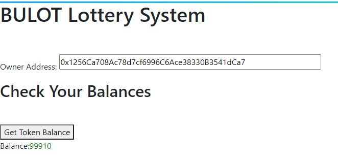
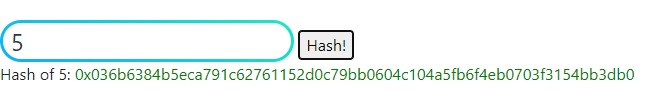
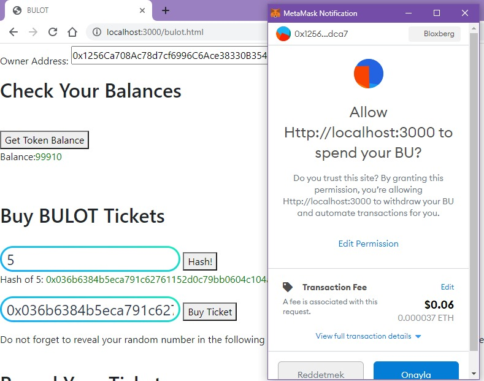
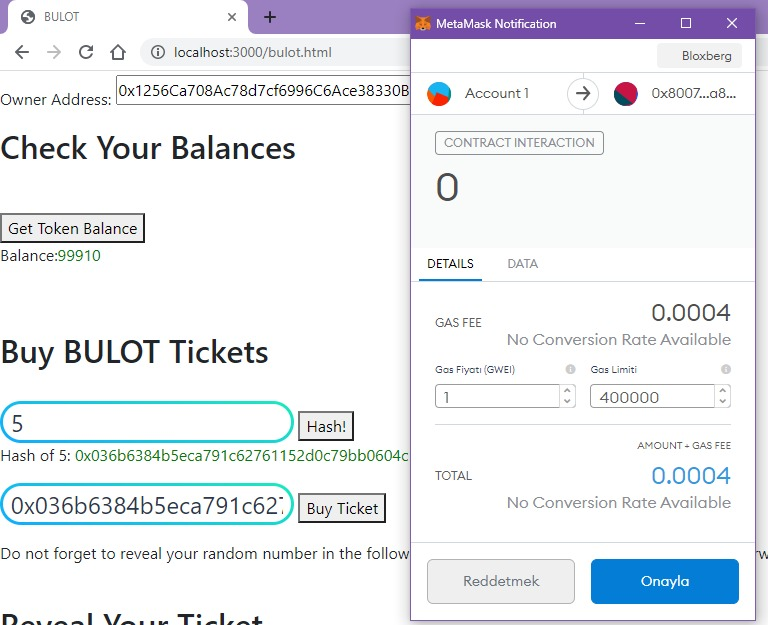
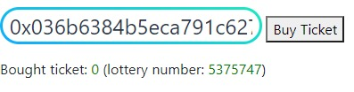
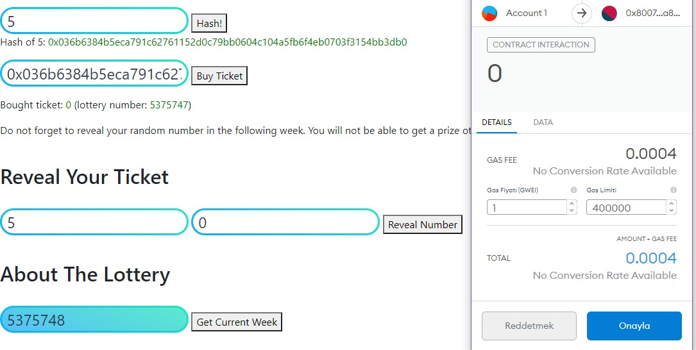
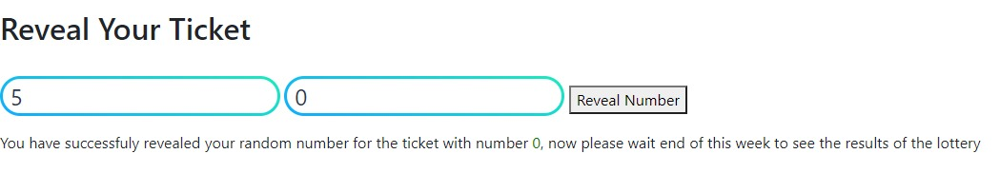
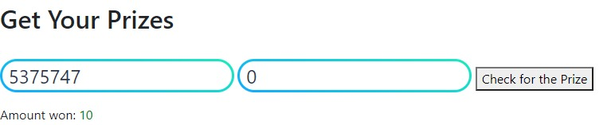
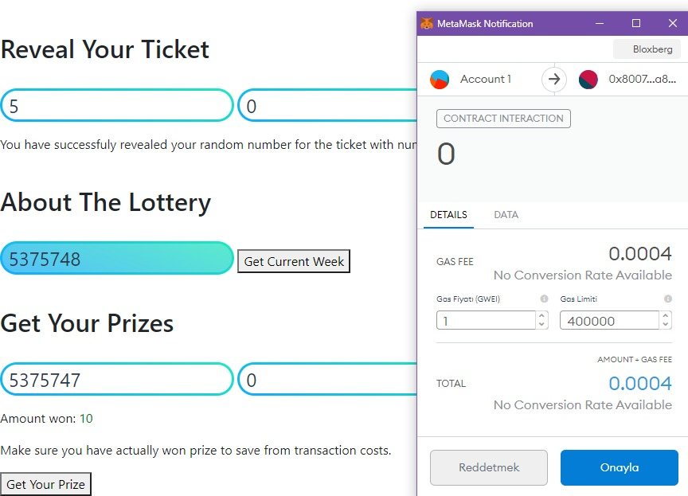
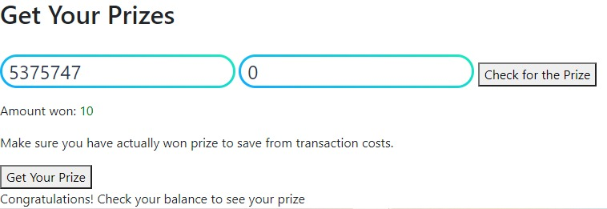

# CMPE 483 Project Part 2

## Notable Changes Since Project 1
* Minor modifications are made to the solidity code that delete some of the storage data after use, to save gas.

## Structure of the Project 2

There are mainly 4 files included:

* `bulot.html`:This is the main file which includes our custom web3 javascript abi and html page structure. It includes the following files and has another version (`bulot_ipfs.html`) that links to the other files using their ipfs CIDs.
* `my.css`:Includes some of our custom style definitions to be used in the main file.
* `bulottokenabi.js`:Includes JSON ABI for our BULOT smart contract presented in Project 1.
* `erc20tokenabi.js`:Includes generic JSON ABI for ERC20 tokens.

These files can be accessed through the http servers we set in our machines, or to emphasize the decentralized nature of the project, they can also be accessed through IPFS network. Their IPFS links are as follows:

* `bulot_ipfs.html`: [QmRjYwpL1CpnN1yF7bqQjDoMszx7QYK5LdX5RQCtftvHaG](https://ipfs.io/ipfs/QmRjYwpL1CpnN1yF7bqQjDoMszx7QYK5LdX5RQCtftvHaG?filename=bulot_ipfs.html)
* `my.css`: [QmdN9hL5HRdiy31uRrggxmSdT6NesYt9c5uQY8xeXFwLuB](https://ipfs.io/ipfs/QmdN9hL5HRdiy31uRrggxmSdT6NesYt9c5uQY8xeXFwLuB?filename=my.css)
* `bulottokenabi.js`: [QmTz6D8QWPtU8BPXCpfBX7jjA7bjE3SHEKvGVEgp858R97](https://ipfs.io/ipfs/QmTz6D8QWPtU8BPXCpfBX7jjA7bjE3SHEKvGVEgp858R97?filename=bulottokenabi.js)
* `erc20tokenabi.js`: [QmfHHFeQQ7BANn6iB97RahZSeJyC4rBe557LrLkruqu2N4](https://ipfs.io/ipfs/QmfHHFeQQ7BANn6iB97RahZSeJyC4rBe557LrLkruqu2N4?filename=erc20tokenabi.js)

## User Interface

### Introduction
When launched, the website gives the user some pop up warning about usage issues related to blockchain systems. Then, if the user does not have a wallet connected, another pop up advises the user to get Metamask, like was done in the example in the lectures. Later, the user can enter some of her addresses and see how many tokens does she have as the specific ERC20 currency we are using in the BULOT system.

### Buying a Ticket
The user can then use our hash calculator to get what she needs to enter while buying a ticket. Then by entering this hash, she can buy a ticket. While buying the ticket, cryptowallet (Metamask in our example) prompts the user twice: one to confirm the transaction of the necessary amount of tokens to the lottery contract, and another to confirm the gas usage associated with calling the BULOT contract to buy the ticket. Once the ticket is bought, the user is shown the ticket number and lottery number associated with the ticket she bought. To keep track of the time, the user can use the current lottery number button anytime.

### Revealing a Ticket's Random Number
Then the user can input the random number she had committed to, to conclude the reveal stage. 

### Checking the Results
Lastly, to see the result of any lottery ticket, and also to redeem any possible prize, the user can use the fields at the last section to enter the lottery number and the ticket number. Then, to save gas, the user can first see how much did the ticket win, then later click the other button to redeem the prize if she won any. 

